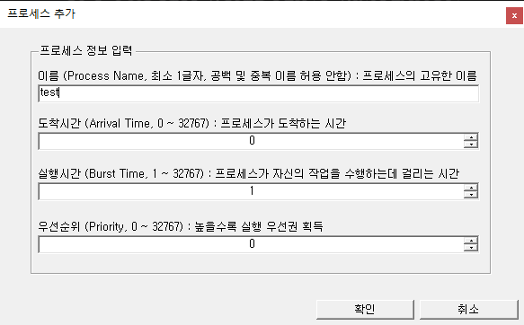

# CPU Process Scheduling Simulation
  
Implementaion of Process Scheduling Algorithm (FCFS, SJF, HRRN, Priority-based scheduling, SRTN, Round-Robin)

 

## < For What & How it works >

### 1. 프로그램의 목표

    각 스케줄링 알고리즘 (FCFS, SJF, HRRN, Priority-based scheduling, SRTN, RR)에 따라,

    1) 스케줄링 과정에 따른 각 프로세스의 상태전이 및 수행과정
    2) 스케줄링 과정에 필요한 총 시간 (=총 시뮬레이션 소요시간)
    3) 누적 CPU 유휴시간
    4) 누적 실행시간
    5) 누적 대기시간
    6) 누적 반환시간
    7) 누적 문맥교환 횟수
    8) 평균 실행시간
    9) 평균 대기시간
    10) 평균 반환시간
    
    을 비교하기 위해 프로세스 스케줄링 과정을 시뮬레이션 한다.

    ---
    ※ CPU 유휴시간 (CPU Idle Time) : CPU가 아무런 작업도 하지 않고 대기하고 있는 시간으로서, 
    현재 준비 큐에 대기 중인 프로세스가 없으며, 또한 현재 CPU의 자원을 할당 받은 프로세스가 없는 상태이다. 
    이 동안 CPU는 다음 프로세스가 도착할 때 까지 아무런 작업도 하지 않고 대기한다.

### 2. 개요

##### 2-1. 프로세스 (Process)

 

<b><u>Fig 1) Process State Transition</u></b>

    프로세스란 실행 중에 있는 프로그램을 의미한다.    

    < 프로세스 상태 및 상태전이 >

    1) 준비 상태 (READY) : CPU의 자원을 할당 받으려고 대기하는 상태
    2) 실행 상태 (RUNNING) : 프로세스가 실행을 위해 선택 된 상태, CPU(또는 코어) 당 최대 하나의 실행 중인 프로세스가 있으며 프로세스의 명령은 CPU(또는 코어)중 하나에 의해 실행된다.
    3) 종료 상태 (TERMINATED) : 프로세스가 자신의 작업을 모두 완료한 상태

    ※ 위, Fig 1) Process State Transition에 따라 실제 프로세스의 상태에는 추가적으로 I/O 작업과 같은 처리를 위한 중지(BLOCKED) 상태가 존재하며, 
    실행 상태에서 I/O 작업 발생 시 중단 상태로 전이되지만, 이는 단순화하기 위해 생략하며, 선점형 스케줄링에서 프로세스 간 선점을 위한 문맥교환이 발생할 경우 강제로 실행 상태에서 준비 상태로 전이한다.

    < 프로세스 정보 >

    1) 도착시간 : 프로세스가 준비 큐에 도착하는 시간
    2) 실행시간 : 프로세스가 자신의 작업을 수행하는데 걸리는 시간
    3) 대기시간 : 프로세스가 준비 큐에서 대기 중인 시간
    4) 반환시간 : 프로세스가 대기하였다가 자신의 작업을 모두 마치고 종료 상태로 전이되는데 걸린 총 시간 (대기시간 + 실행시간)
    5) 우선순위 : 스케줄링 과정에서 먼저 자원이 할당되는 우선권으로서 높을수록 자원 할당 우선권을 획득한다. (ex: 우선순위 5는 우선순위 0보다 실행 우선권을 갖는다.)

##### 2-2. 프로세스 스케줄링 (Process Scheduling)

 

<b><u>Fig 2) Windows 환경의 작업 관리자</u></b>

    프로세스 스케줄링은 여러 프로세스가 번갈아 사용하는 CPU(프로세서)의 자원을 어떤 시점에 어떤 프로세스에 할당할지 결정하는 것으로서,
    위, Fig 2) Windows 환경의 작업 관리자를 보면 여러 프로세스들이 수행되고 있음을 알 수 있다.
    하지만, 프로세서(혹은 코어) 당 최대 프로세스 하나만 처리(실행) 할 수 있으며, 실행을 위해 대기 중인 프로세스는 준비 큐에서 기다리게 된다. 
    현대의 컴퓨터는 다중 프로세서(혹은 다중 코어) 및 하이퍼스레딩 기술(단일 물리적 프로세서 코어가 논리 프로세서가 두 개인 것처럼 작동하는 기술)등으로 병렬처리를 수행하지만,
    문제를 단순화하기 위해 한 번에 하나의 프로세스만 처리 할 수 있는 단일 프로세서(혹은 단일 코어) 시스템을 가정한다.

##### 2-3. 스케줄링의 목적

    1) 자원 할당의 공정성 보장 : 어떤 프로세스도 실행을 무한 연기해서는 안된다.
    2) 단위시간당 처리량 최대화 : CPU의 처리량을 최대화하여 가능한 많은 프로세스에 서비스를 제공한다.
    3) 적절한 반환시간 보장 : 적절한 시간안에 프로세스가 작업을 마칠 수 있도록 해야 한다.
    4) 예측 가능성 보장 : 프로세스를 시스템 부하와 상관없이 거의 같은 시간에 거의 같은 비용으로 실행할 수 있어야 한다.
    5) 오버헤드 최소화 : 자원 낭비를 막기 위해 오버헤드를 최소화해야한다.
    6) 자원 사용의 균형 유지 : 시스템의 자원을 쉬지 않고 사용할 수 있도록 스케줄링을 해야 한다. 따라서 유휴 상태의 자원을 사용하려는 프로세스에 특별한 혜택을 줄 수도 있다.
    7) 반환시간과 자원의 활용 간에 균형 유지 : 충분한 자원을 활용할 경우 반환시간을 빠르게 할 수 있지만, 한 프로세스가 너무 많은 자원을 차지하면 시스템의 자원 활용도가 떨어진다.
    8) 실행 대기 방지 : 프로세스의 실행을 무한 연기하지 않도록 높은 우선순위를 부여하거나 Aging 방법을 이용한다.
    9) 우선순위 : 프로세스에 우선순위를 부여하여 높은 우선순위를 가진 프로세스에 먼저 자원을 할당하거나, 선점할 수 있도록 한다.
    10) 서비스 사용 기회 확대 : 프로세스에 더 자주 서비스 사용 기회를 주어야 한다.
    11) 서비스 수 감소 방지 : 시스템에 부하가 많이 걸릴 때 갑자기 서비스 수가 감소하면 안 된다.

##### 2-4. 스케줄링의 종류

    1) 비선점형 스케줄링
    : 한 프로세스가 자원(CPU)를 할당 받았을 시, 다른 대기 중인 프로세스가 해당 자원을 빼앗지 못하도록 하는 스케줄링 방법으로서, 
    FCFS, SJF, HRRN, Priority based-scheduling (Non-Preemptive) 등이 있다.

    - 장점 : 일괄 처리(Batch Processing)방식으로서, 응답 시간을 예측하기 용이하며, 선점형 방식에 비해 오버헤드가 매우 적다.
    - 단점 : 실행시간이 매우 긴 프로세스가 CPU의 자원을 사용할 경우, 실행시간이 짧은 프로세스들을 오랫동안 대기시키므로, 처리율이 떨어진다.

    2) 선점형 스케줄링
    : 비선점형과 반대로 다른 대기 중인 프로세스가 해당 자원을 빼앗으면서 기존에 실행 중이던 프로세스는 준비 상태로 전이(문맥교환)되는 스케줄링 방법으로서, 
    SRTN, Round-Robin, Priority based-scheduling (Preemptive) 등이 있다.

    - 장점 : 프로세스 하나가 장시간 CPU를 독점하는 것을 방지하기 때문에 모든 프로세스에 CPU의 자원을 서비스 할 기회를 늘릴 수 있다.
    - 단점 : 문맥교환 및 선점을 위한 적절한 프로세스를 선택하기 위하여 상당한 오버헤드를 유발 할 수 있다.

    ---
    ※ 문맥교환 (Context Switch) : 프로세스들에게 CPU의 자원을 할당해 줄 때, 현재 자원이 할당된 프로세스의 정보를 PCB에 저장하고 새로운 프로세스에게 CPU의 자원을 할당하여 실행되도록 하는 것이다.
    ※ Time Quantum (Time Slice) : 선점형 스케줄링을 위한 규정 시간량(단위 시간)으로서, 특정 프로세스가 해당 규정 시간량동안 실행되도록 한다.
    이 시간이 지나면 스케줄러에 의해 다른 프로세스가 선점할 수 있으며, 기존 프로세스는 문맥교환이 발생하여 다시 준비 큐로 이동 할 수 있다.

##### 2-5. 준비 큐 (Ready Queue)

    프로세스에 대한 스케줄링 작업 시 사용하는 준비 큐로서, 프로세스가 시스템에 들어오면 (도착하면) 프로세스가 실행 대기 상태로서 준비 큐에서 CPU의 자원을 할당 받기 위해 대기하며, 
    준비 큐에서 순차적으로 (FIFO : 제일 먼저 들어온 것을 제일 먼저 처리) 프로세스를 꺼내어 CPU의 자원을 할당한다. 

##### 2-6. 도착 큐 (Arrival Queue)

    프로세스 준비 큐에 삽입되어 준비 상태로 들어가기 전 프로세스 간 도착시간에 따른 빠른 순으로 준비 큐에 동적으로 추가를 위한 큐로서 도착 큐는 모든 프로세스가 동일시간에 도착한다고 가정 시 사용하지 않는다.
    실제 CPU의 자원을 프로세스에 할당하기 위한 스케줄링 동작과정에 도착 큐라는 개념이 존재하지 않지만, 각 프로세스 별 도착시간을 할당하여 시뮬레이션 하는 상황을 사용자가 각 프로세스의 도착시간에 따라 도착시간에 해당하는 프로세스를 
    실행한다고 가정하여 프로세스가 CPU의 자원을 할당 받기 위해 프로세스 준비 큐로 들어가는 상황을 만들기 위해 도착 큐를 별도로 사용하였다.

### 3. 프로그램 흐름

 

<b><u>Fig 3) Main Flow</u></b>

    test

 

<b><u>Fig 4) Process Arrival Event & Pre-processing Proc</u></b>

    t

 

<b><u>Fig 5) CPU Processing Proc</u></b>

    a

 

<b><u>Fig 6) Process - DoSelfProcessJob</u></b>

    ab

 

## < Features >
#### - Supported Scheduling Type

    1) First Come First Service (비선점형) : 선입선출 방식으로 제일 먼저 도착한 프로세스부터 처리
    2) Shortest Job First (비선점형) : 실행시간이 제일 짧은 순으로 처리
    3) Highest Response-Ratio Next (비선점형) : (대기시간+실행시간) / 실행시간으로 우선순위 할당하여 높은 순으로 처리
    4) Priority-based scheduling (비선점형) : 초기 할당 된 우선순위를 이용하는 고정 우선순위 기반 스케줄링
    5) Shortest Remaining Time Next (선점형) : 미리 정의 된 Time Quantum 만큼 실행 후 남은 실행시간이 제일 짧은 순으로 처리, SJF의 선점형
    6) Round-Robin (선점형) : 미리 정의 된 Time Quantum 만큼 모든 프로세스에 대해 돌아가며 처리
    7) Priority-based scheduling (선점형) : 초기 할당 된 우선순위를 이용하는 고정 우선순위 기반 스케줄링

#### - Option for Process Scheduling

    1) Ignore Option for ignoring User Input Process's Prioirty (or not)
    2) Ignore Option for ignoring User Input Process's Arrival Time (or not)
    3) Time Quantum Option for Preemptive Scheduling
    
 

## < Demo & Screenshot >

 

<b><u>Fig 7) 메인 폼</u></b>

 

<b><u>Fig 8) 옵션 폼</u></b>

 

<b><u>Fig 9) 프로세스 추가 폼</u></b>

 

<b><u>Fig 10) 실행 결과</u></b>

 

## < System Requirement >
- .Net Framework 4.8

 

## < References >
- 그림으로 배우는 구조와 원리 : 운영체제 개정 3판 (한빛 아카데미)
- 2021 시나공 정보처리기사 필기 & 실기
- http://www.soen.kr/book/dotnet/annex/annex4.htm
- https://en.wikipedia.org/wiki/Process_state
- https://docs.oracle.com/cd/E19683-01/816-5042/psched-16/index.html
- https://examradar.com/process-scheduling-algorithm-fcfs-first-come-first-serve-questions-answers/
- https://www.studytonight.com/operating-system/highest-response-ratio-next-hrrn-scheduling
- MSDN .net Example

 

## < License >
[This application is licensed under the MIT License.](./LICENSE)</b>  